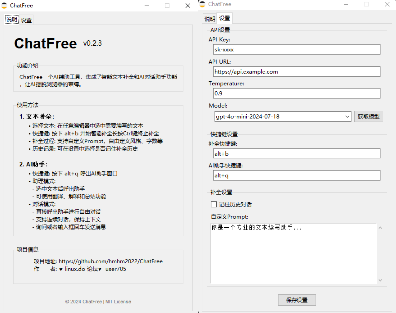
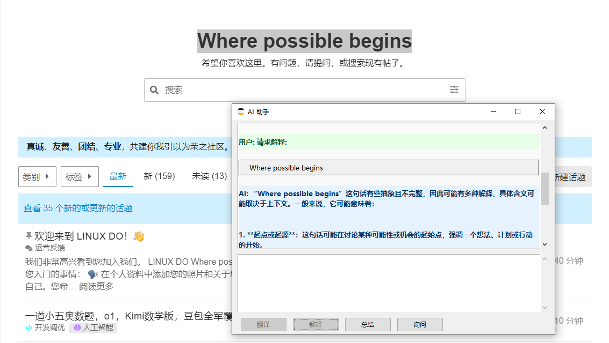

# ChatFree

ChatFree 是一个基于 Python 开发的 AI 辅助工具，集成了智能文本补全和 AI 对话助手功能，让 AI 摆脱浏览器的束缚。

</div>

## ✨ 技术特性

- 📝 多模型支持
- 🔧 高度可配置的API设置
- 🌐 系统代理自动识别
- 🚀 快捷键操作支持

## 📸 功能展示

<div align="center">

<p>主界面</p>
</div>

<div align="center">

<p>设置界面</p>
</div>

## 📦 安装部署

### 快速开始

1. 从 [Releases](https://github.com/hmhm2022/ChatFree/releases) 下载最新版本
2. 解压到任意目录
3. 运行 ChatFree.exe
4. 配置 API 密钥（参考[配置说明](#-配置说明)）

### 源码运行
```bash
git clone https://github.com/hmhm2022/ChatFree
cd ChatFree
pip install -r requirements.txt
python main.py

```

### 依赖说明

- Python 3.7+
- requests: HTTP 客户端
- pystray: 系统托盘支持
- keyboard: 快捷键支持
- Pillow: 图像处理
- pywin32: Windows系统API封装
  - 提供剪贴板访问功能
  - 支持系统代理设置读取
  - 用于注册表操作

### 构建说明

使用 PyInstaller 构建：
```bash
pip install pyinstaller
pyinstaller main.spec
```

## 🔧 配置说明

### 配置文件

在 `config.json` 中配置：
```json
json
{
"api_key": "你的API密钥",
"api_url": "API地址",
"model": "使用的模型",
"temperature": 0.7,
"keep_history": false,
"custom_prompt": "自定义提示词",
"hotkey": "alt+b",
"assistant_hotkey": "alt+q"
}
```

## 💡 使用方法

### 1. 文本补全
- 📝 选择文本：在任意可编辑区域中选中需要续写的文本
- ⌨️ 快捷键：按下 `alt+b`（默认，可自定义） 智能补全，长按Ctrl键可暂停
- 🎯 补全过程：支持自定义Prompt，自由定义风格，字数等
- 📚 历史记录：可在设置中选择是否记住补全历史

### 2. AI助手
- 🚀 快速唤醒：按下 `alt+q`（默认，可自定义） 呼出AI助手窗口
- 📖 助理模式：
  - 选中文本后呼出助手
  - 支持翻译、解释和总结功能
- 💬 对话模式：
  - 直接呼出助手进行自由对话
  - 支持连续对话，保持上下文
  - 点击发送或回车键发送消息

## 📜 许可证

本项目采用 MIT 许可证 - 查看 [LICENSE](LICENSE) 文件了解详情。

## 🙏 鸣谢

- [ChatAnywhere](https://github.com/LiangYang666/ChatAnywhere)  给我启发
- [Linux.do论坛](https://linux.do) 不装了，我是兵马俑

<div align="center">

如果这个项目对你有帮助，请点一下 ⭐️

</div>
